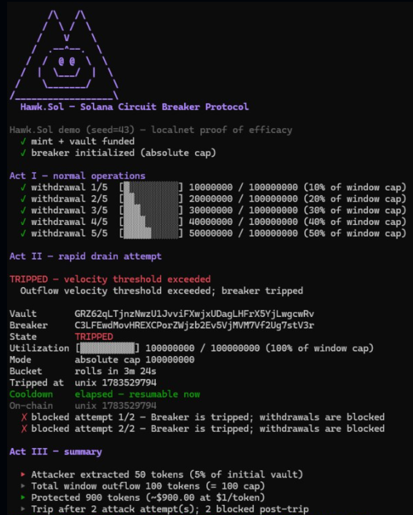
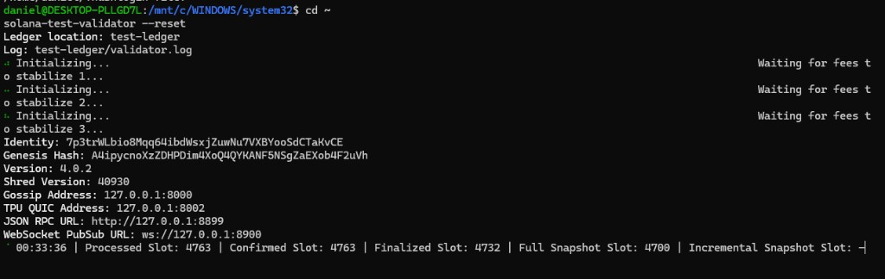

# Hawk.Sol

**Solana Circuit Breaker Protocol**

Hawk.Sol is an on-chain velocity breaker for SPL token vaults. It lets a protocol route all vault withdrawals through a PDA-controlled guard that enforces a sliding-window outflow cap, supports guardian emergency stops, and proves that a compromised operator can only extract funds up to the configured window limit.

The command remains `solhawk`.



## What It Does

- **Protects SPL vaults** by moving vault authority to a program-derived breaker authority.
- **Caps outflow velocity** with 12-bucket sliding-window accounting.
- **Blocks rapid drains** by tripping before the transfer CPI when a withdrawal would exceed the cap.
- **Separates powers** between operator withdrawals and guardian emergency or governance controls.
- **Ships with a local demo** that shows normal withdrawals, an attack attempt, the trip, post-trip blocks, and summary math.

## Demo Result

With the default demo parameters:

- Vault starts with **1,000 tokens**.
- Normal usage spends **50 tokens**.
- Attacker gets exactly **50 tokens** in Act II.
- Total window outflow reaches exactly **100 tokens**, the configured cap.
- The tripping transaction returns success so the trip state persists, but the transfer CPI is unreachable on that path.
- Further withdrawal attempts fail with `6000` (`Tripped`).



Run it locally:

```bash
solana-test-validator --reset
anchor deploy
solhawk demo --seed 43
```

Machine-readable output:

```bash
solhawk demo --seed 43 --json
```

## Core Instructions

| Instruction | Caller | Purpose |
|---|---|---|
| `initialize_breaker` | Payer + vault authority | Creates breaker PDAs and transfers vault authority to the breaker PDA. |
| `guarded_withdraw` | Operator | Records outflow, checks the cap, and performs the PDA-signed SPL transfer only when still safe. |
| `trip` | Guardian | Manual emergency stop. |
| `resume` | Guardian, or anyone after cooldown if `auto_recover` is enabled | Restores `Tripped -> Active`. |
| `propose_config_change` | Guardian | Opens a timelocked config change. |
| `execute_config_change` | Guardian | Applies an elapsed config change. |
| `cancel_config_change` | Guardian | Cancels a pending config change. |
| `emergency_route_to_safe` | Guardian | Routes funds to the immutable safe destination while tripped. |

## Security Model

Hawk.Sol is designed around a narrow, auditable transfer surface:

- **Sole transfer path:** protected vault funds move only through `guarded_withdraw` or guardian-only emergency routing while tripped.
- **PDA authority:** the breaker authority PDA is the only signer that can transfer from the vault after initialization.
- **Window before CPI:** window accounting happens before token movement.
- **Trip persistence:** on threshold breach, the program sets `Tripped` and returns `Ok(())`; returning an error would roll back the trip under Solana transaction atomicity.
- **No transfer on trip:** the velocity-trip path returns before the transfer CPI, so the tripping call does not move funds.
- **Canonical PDA validation:** breaker, window, authority, and pending config accounts are derived and validated from fixed seeds.
- **Governance delay:** mutable config changes go through guardian proposal and timelocked execution.

## CLI

The CLI crate is named `solhawk` and exposes operational commands:

```bash
solhawk status <VAULT>
solhawk status <VAULT> --json

solhawk init <VAULT> --mint <MINT> --guardian <PUBKEY> --operator <PUBKEY> --safe-destination <TOKEN_ACCOUNT>
solhawk trip <VAULT>
solhawk resume <VAULT>

solhawk demo
solhawk demo --json
```

Global defaults:

- RPC: `http://127.0.0.1:8899`
- Local program ID: `7Wuw9J1cW8V2R1KAA6T3y3bRDpBYJ5FkQWMj8gDKb1MW`
- Default keypair: `~/.config/solana/id.json`

## Build And Test

This repo is intended to be built from WSL2/Linux for LiteSVM compatibility.

```bash
cd /mnt/c/Users/USAJu/Desktop/SolHawk/Hawk.Sol

anchor build

cargo test -p circuit_breaker
cargo test -p circuit-breaker-tests
cargo test -p solhawk
```

Full test sweep:

```bash
cargo test -p circuit_breaker -p circuit-breaker-tests -p solhawk
```

## Project Layout

```text
Hawk.Sol/
├── programs/circuit_breaker/      # Anchor on-chain program
│   └── src/
│       ├── instructions/          # Instruction handlers
│       ├── state/                 # BreakerConfig, WindowState, pending config
│       ├── window/accounting.rs   # Sliding-window accounting
│       ├── error.rs               # Program errors 6000+
│       └── lib.rs                 # Accounts + dispatch
├── cli/                           # `solhawk` command
│   ├── src/commands/              # status/init/trip/resume/demo
│   ├── src/ix/                    # Instruction builders
│   ├── src/rpc/                   # RPC fetch/decode/tx helpers
│   └── tests/                     # CLI render + demo math tests
├── integration-tests/             # LiteSVM integration suite
├── docs/                          # Account, CPI, PDA, event, error docs
└── Anchor.toml
```

## Docs

- `docs/PDAs.md`
- `docs/CPIs.md`
- `docs/events.md`
- `docs/errors.md`
- `docs/space.md`

## Status

Hawk.Sol currently includes the core breaker, governance controls, CLI operations, and reproducible local proof-of-efficacy demo.
